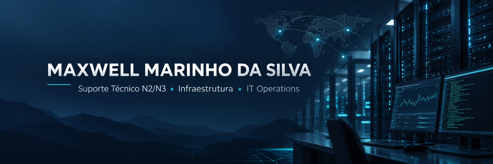

 

<h1>Maxwell Marinho da Silva</h1>

<h3>Analista de Suporte Técnico | N2/N3 | Infraestrutura de TI | IT Operations</h3>

<strong>Suporte Técnico • Infraestrutura • Linux • Windows Server • Redes • ITSM • Monitoramento • Automação</strong>

Profissional de Tecnologia da Informação com <strong>mais de 12 anos de experiência</strong>, atuando em suporte técnico, infraestrutura e operações de TI, com foco em <strong>troubleshooting, gestão de incidentes, continuidade operacional e sustentação de ambientes corporativos</strong>.

 

  

---

## 👨‍💻 Perfil profissional

Profissional de **Tecnologia da Informação com mais de 12 anos de experiência**, com trajetória em **Suporte Técnico N2/N3, Infraestrutura e Operações de TI**, atuando em ambientes corporativos e operações críticas de negócio.

Experiência em **diagnóstico e resolução de incidentes, troubleshooting, Service Desk/ITSM, acompanhamento de SLA, suporte remoto, análise de problemas, monitoramento, documentação técnica e sustentação de sistemas corporativos**.

Atuação com **Linux, Windows Server, Active Directory, redes TCP/IP, DNS, DHCP, VPN, bancos de dados, monitoramento com Zabbix e Grafana, análise de logs e suporte a ambientes ERP, WMS e frente de caixa/PDV**.

Automação e desenvolvimento complementam minha atuação em infraestrutura e suporte. Meus projetos públicos demonstram aplicação prática de **Java, Python, Shell Script, APIs, integrações HTTP, processamento de arquivos, JSON, SNMP, Zabbix e desenvolvimento de ferramentas voltadas à solução de problemas reais**.

> **Especialidade principal:** Suporte Técnico N2/N3 e Infraestrutura de TI
> **Contexto operacional:** IT Operations, ITSM, incidentes, troubleshooting e continuidade de serviços
> **Diferencial técnico:** automação, integração de sistemas e desenvolvimento de ferramentas aplicadas à operação

---

## 🎯 Principais áreas de atuação

<table>
<tr>
<td valign="top" width="50%">

<h3>🖥️ Suporte & Operações</h3>

<ul>
<li>Suporte Técnico N1/N2/N3</li>
<li>Troubleshooting</li>
<li>Gestão de incidentes</li>
<li>Análise de problemas</li>
<li>Service Desk</li>
<li>ITSM</li>
<li>SLA</li>
<li>Suporte remoto</li>
<li>Continuidade operacional</li>
<li>Documentação técnica</li>
<li>Base de conhecimento</li>
</ul>

</td>

<td valign="top" width="50%">

<h3>⚙️ Infraestrutura & Sistemas</h3>

<ul>
<li>Linux</li>
<li>Windows Server</li>
<li>Active Directory</li>
<li>Administração de sistemas</li>
<li>Redes TCP/IP</li>
<li>DNS</li>
<li>DHCP</li>
<li>VPN</li>
<li>Monitoramento</li>
<li>Análise de logs</li>
<li>Sistemas corporativos</li>
</ul>

</td>
</tr>

<tr>
<td valign="top" width="50%">

<h3>📊 Monitoramento & Dados</h3>

<ul>
<li>Zabbix</li>
<li>Grafana</li>
<li>SNMP</li>
<li>SQL</li>
<li>MySQL</li>
<li>SQL Server</li>
<li>MongoDB</li>
<li>JSON</li>
<li>Análise e tratamento de dados</li>
</ul>

</td>

<td valign="top" width="50%">

<h3>🤖 Automação & Desenvolvimento</h3>

<ul>
<li>Python</li>
<li>Shell Script</li>
<li>Java</li>
<li>Swing</li>
<li>Maven</li>
<li>APIs</li>
<li>Integrações HTTP</li>
<li>Processamento de arquivos</li>
<li>C++ / Arduino</li>
<li>Automação de processos</li>
</ul>

</td>
</tr>
</table>

---

## 🛠️ Tecnologias e ferramentas

### 🖥️ Sistemas e Infraestrutura

  
  
  

### 🌐 Redes e Serviços

  
  
  
  
  
  

### 📊 Monitoramento e Observabilidade

  
  

### 🎫 ITSM e Operações

  
  
  
  
  

### 🗄️ Bancos de Dados e Dados

  
  
  
  
  

### 🤖 Automação e Scripting

  
  

### ☕ Desenvolvimento aplicado

  
  
  
  
  
  
  

---

## 🚀 Projetos em destaque

### 🔎 [ConsultaSeloDigital](https://github.com/MaxwellMarinhodaSilva/ConsultaSeloDigital)

Aplicação desktop desenvolvida para **centralizar consultas de selos digitais de tribunais**, permitindo processamento individual e em lote por meio de uma interface gráfica.

O projeto aplica desenvolvimento de software diretamente à resolução de uma necessidade operacional, reunindo consulta de dados, processamento, histórico, importação, exportação e tratamento das informações retornadas pelos serviços externos.

#### Principais recursos

* consultas individuais e em lote;
* integração com serviços públicos de consulta;
* processamento de respostas HTTP;
* importação de arquivos TXT, CSV e XLSX;
* histórico de consultas;
* exportação de resultados em PDF e XLSX;
* geração e tratamento de QR Code;
* tratamento de erros;
* interface gráfica desktop;
* parsing e organização das informações consultadas.

**Tecnologias:** `Java 21` `Swing` `Maven` `Java HTTP Client` `Jackson` `Apache POI` `PDFBox` `ZXing` `FlatLaf`

---

### 🛠️ [IndicadorReal](https://github.com/MaxwellMarinhodaSilva/IndicadorReal)

Aplicação desktop criada para **automatizar a análise e correção de informações em arquivos**, interpretando registros de erro em TXT ou texto informado diretamente pelo usuário e realizando o cruzamento das informações com dados estruturados em JSON.

A aplicação identifica as matrículas relacionadas aos erros, ajusta o campo `TIPOENVIO`, preserva o arquivo original e gera os artefatos resultantes da operação.

#### Principais recursos

* interpretação de registros de erro;
* leitura de TXT e texto informado pelo usuário;
* processamento de JSON;
* cruzamento de matrículas;
* correção automatizada do campo `TIPOENVIO`;
* preservação do arquivo original;
* geração de novo JSON;
* geração de relatório;
* geração de log de execução.

**Tecnologias:** `Java 21` `Swing` `Maven` `Jackson` `JSON` `Regex` `FlatLaf`

---

### 🌡️ [Monitoramento de Temperatura e Umidade via SNMP](https://github.com/MaxwellMarinhodaSilva/arduino-snmp-zabbix-dht22)

Projeto de monitoramento que integra **Arduino, sensor DHT22, rede Ethernet, protocolo SNMP e Zabbix** para disponibilizar informações de temperatura e umidade a uma plataforma de monitoramento.

O projeto demonstra integração entre **hardware, redes, protocolo de gerenciamento e monitoramento de infraestrutura**.

#### Principais recursos

* coleta periódica de temperatura;
* coleta periódica de umidade;
* armazenamento das leituras em memória;
* implementação de agente SNMP;
* disponibilização das informações por meio de OIDs personalizadas;
* integração com Zabbix;
* comunicação por meio de Ethernet Shield W5100.

**Tecnologias:** `Arduino` `C++` `SNMP` `Zabbix` `Ethernet W5100` `DHT22` `Agentuino`

---

## 💼 Experiência profissional

### 🏢 Virtus Sistemas

#### Suporte Técnico

**abr. de 2026 – atual**

Atuação em suporte técnico especializado de soluções de software voltadas à automação de serviços notariais, registrais e de distribuição, com foco em estabilidade, continuidade e resolução de incidentes em produção.

**Principais responsabilidades:**

* atendimento e suporte técnico a clientes e usuários;
* investigação, diagnóstico e resolução de incidentes em produção;
* análise de logs de aplicações Java/Tomcat;
* consultas e correções em bancos de dados SQL;
* validação e tratamento de arquivos XML, JSON e TXT;
* apoio a integrações;
* acompanhamento de chamados e SLA;
* documentação de falhas recorrentes.

---

### 🏢 TNS América Latina

#### Suporte Técnico Pleno

**jan. de 2024 – jul. de 2025**

#### Suporte Técnico Júnior

**jul. de 2022 – jan. de 2024**

Atuação em **Suporte Técnico N2/N3 e operações de TI**, com foco em diagnóstico e resolução de incidentes, continuidade operacional e atendimento de demandas técnicas.

**Principais atividades:**

* atendimento e resolução de incidentes;
* troubleshooting de demandas técnicas;
* gestão e acompanhamento de chamados;
* atuação com Service Desk/ITSM;
* acompanhamento de prioridades e SLA;
* investigação e tratamento de problemas;
* documentação técnica;
* interação com equipes internas;
* interface com fornecedores;
* colaboração com outras áreas técnicas;
* apoio à estabilidade e continuidade dos serviços.

> A progressão de **Suporte Técnico Júnior para Suporte Técnico Pleno** representa parte importante da minha evolução profissional dentro da empresa.

---

### 🏢 Rede Menor Preço de Supermercado

#### Técnico de Informática

**jun. de 2015 – out. de 2019**

Responsável pelo suporte técnico e sustentação de ambientes de TI distribuídos entre **12 unidades**, atendendo aproximadamente **200 estações de trabalho e sistemas corporativos**.

**Principais atividades:**

* Suporte Técnico N2/N3;
* sustentação de aproximadamente 200 estações de trabalho;
* suporte às 12 unidades da empresa;
* atendimento técnico aos usuários;
* suporte a sistemas ERP;
* suporte a WMS;
* suporte a sistemas de frente de caixa/PDV;
* diagnóstico e resolução de incidentes;
* apoio à infraestrutura de TI;
* interação com equipes técnicas;
* implementação de melhorias operacionais.

---

<strong>📂 Experiências anteriores relacionadas à minha trajetória profissional</strong>

 

<h3>🏢 Qualitech Informática</h3>

<strong>Vendedor | mai. de 2014 – mai. de 2015</strong>

Atuação na comercialização de equipamentos e soluções de Tecnologia da Informação, auxiliando clientes na identificação de produtos e soluções adequadas às suas necessidades.

<h3>🏢 Superbox Brasil Supermercados</h3>

<strong>Gerente Comercial | set. de 2010 – mar. de 2014</strong>

Atuação integrada às áreas comercial e de Tecnologia da Informação, incluindo gestão de sistemas ERP, infraestrutura de redes e apoio a projetos de TI e melhoria de processos corporativos.

<h3>🏢 Carrefour Comércio e Indústria Ltda.</h3>

<strong>Auxiliar de TI / Suporte Técnico | parte da trajetória entre 2005 e 2009</strong>

Atuação com suporte técnico a sistemas, equipamentos e soluções de ponto de venda, além de apoio à manutenção da infraestrutura e resolução de incidentes.

 

📌 O histórico profissional completo, incluindo todos os cargos e períodos, está disponível no meu [LinkedIn](https://www.linkedin.com/in/maxwell-m-s/).

---

## 🎓 Formação acadêmica

### 🎓 Mestrado em Modelagem Matemática e Computacional

**Universidade Federal da Paraíba — UFPB**
`2022 – 2024`

---

### 🎓 Bacharelado em Ciência da Computação

**Faculdade Internacional da Paraíba — FPB**
`2018 – 2021`

---

## 🏅 Certificações e formação complementar

### 🛡️ Cibersegurança

* **Fortinet Certified Associate in Cybersecurity** — Fortinet
  `2025 – 2027`

* **Fortinet Certified Fundamentals in Cybersecurity** — Fortinet
  `2025 – 2027`

### 🎫 ITSM e Service Management

* **Jira Service Management — ITSM** — Udemy
  `2026`

### 📊 Monitoramento e Observabilidade

* **Introdução ao Splunk** — Udemy
  `2026`

### 🐧 Linux e Shell

* **Linux System Engineer** — LinkedIn Learning
  `2024`

* **Learning Linux Shell Scripting** — LinkedIn Learning
  `2024`

* **Shell Script** — Udemy

* **Fundamentos em Linux** — WB

### 🐍 Automação e Programação

* **Python** — Alfahelix

### 🗄️ Bancos de Dados

* **SQL Essential** — LinkedIn Learning

> A formação complementar apresentada aqui foi selecionada por relevância para **Suporte Técnico, Infraestrutura, IT Operations, Linux, automação, bancos de dados, ITSM, monitoramento e segurança**.

---

## 📫 Contato

  

<strong>Suporte Técnico • Infraestrutura • IT Operations • Monitoramento • Automação</strong>

  

<strong>Maxwell Marinho da Silva</strong>

